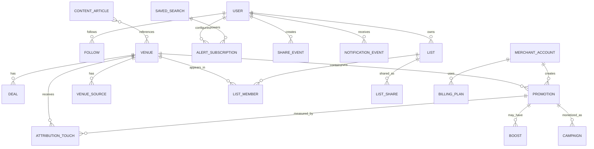

# Data Model Sketch

## Goal

This is a conceptual model for the app's next stage. It is intentionally broader than "restaurant happy hour" so the product can expand into venues, events, and campaigns without a redesign.

## Core Entities

| Entity | Purpose |
| --- | --- |
| User | Consumer account and notification recipient |
| Venue | A restaurant, bar, brewery, club, coffee shop, or other local place |
| VenueSource | A source record showing where venue data came from |
| Deal | A recurring or temporary offer attached to a venue |
| Promotion | A merchant-created campaign with a time window and status |
| Campaign | A monetized promotion or boost wrapper |
| Boost | Paid incremental reach attached to a promotion |
| Follow | A user following a venue, neighborhood, or saved search |
| SavedSearch | A user-defined query or filter set |
| List | A private or shared collection of venues |
| ListMember | A venue in a list |
| ListShare | A share link or invited collaboration relationship |
| AlertSubscription | A notification rule tied to a user and a target |
| NotificationEvent | A notification sent or queued by the system |
| ShareEvent | A tracked share action and its destination |
| MerchantAccount | A venue owner or operator account |
| BillingPlan | Subscription tier and entitlements |
| AttributionTouch | A tracked user action tied to a promotion or merchant campaign |
| ContentArticle | An editorial asset tied back to venues or neighborhood data |

## Mermaid ER Sketch

## Field Sketch

### User

1. `id`
2. `email`
3. `phone`
4. `display_name`
5. `timezone`
6. `created_at`
7. `updated_at`

### Venue

1. `id`
2. `name`
3. `slug`
4. `category`
5. `address`
6. `neighborhood`
7. `city`
8. `state`
9. `latitude`
10. `longitude`
11. `status`
12. `claimed_by_merchant_account_id`
13. `source_confidence`
14. `last_verified_at`

### Deal

1. `id`
2. `venue_id`
3. `title`
4. `description`
5. `price_text`
6. `days_of_week`
7. `start_time`
8. `end_time`
9. `effective_start_date`
10. `effective_end_date`
11. `source_id`

### Promotion

1. `id`
2. `venue_id`
3. `title`
4. `description`
5. `type`
6. `status`
7. `starts_at`
8. `ends_at`
9. `created_at`
10. `updated_at`
11. `primary_cta_label`
12. `primary_cta_url`
13. `secondary_links`
14. `created_by`

### Campaign

1. `id`
2. `promotion_id`
3. `pricing_model`
4. `spend_amount`
5. `impressions_target`
6. `audience_target`
7. `boost_status`
8. `billing_reference`

### List

1. `id`
2. `owner_user_id`
3. `title`
4. `description`
5. `visibility`
6. `collaboration_mode`
7. `created_at`
8. `updated_at`

### AlertSubscription

1. `id`
2. `user_id`
3. `target_type`
4. `target_id`
5. `alert_family`
6. `delivery_channel`
7. `enabled`
8. `quiet_hours_start`
9. `quiet_hours_end`
10. `paused`

### MerchantAccount

1. `id`
2. `venue_id`
3. `owner_name`
4. `email`
5. `billing_customer_id`
6. `plan_id`
7. `status`

### AttributionTouch

1. `id`
2. `promotion_id`
3. `user_id`
4. `touch_type`
5. `source`
6. `created_at`
7. `metadata`

## Status Logic

### Venue Level

1. `HAPPY HOUR NOW` is computed from recurring happy-hour windows.
2. It should not be stored as a mutable venue boolean.

### Promotion Level

1. `Draft` means not public.
2. `Scheduled` means it has a future start time.
3. `Live` means `starts_at <= now < ends_at`.
4. `Ended` means the promotion has expired.
5. `Cancelled` should short-circuit the live state.

## Provenance Rules

1. Each venue field should have a source.
2. Source conflicts should resolve by confidence and freshness.
3. The UI should preserve a last verified timestamp.
4. Merchant edits should be distinguishable from imported data.

## Tracking Events

The system should record at least these event families:

1. View
2. Search
3. Save
4. Follow
5. Share
6. Alert subscribe
7. Alert open
8. Venue page click
9. Call click
10. Direction request
11. Claim
12. Redemption
13. Upgrade
14. Promotion create

## Notes

1. The model should support restaurants, bars, breweries, coffee shops, events, nightlife, and entertainment venues.
2. The model should keep consumer and merchant concerns separate while allowing them to connect through promotions and analytics.
3. The model should make it possible to answer the question, "What generated measurable demand?" without collapsing all behavior into a single metric.
