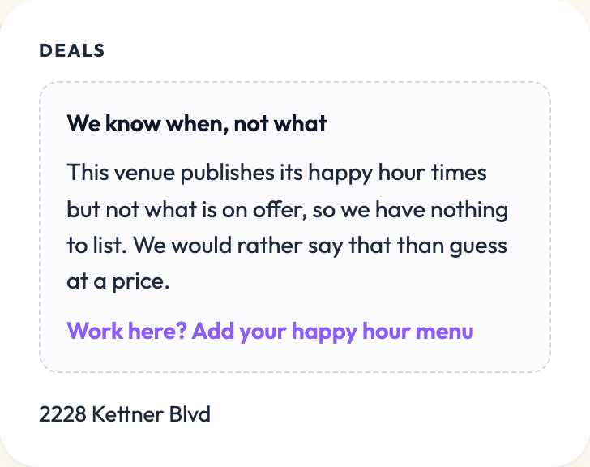

# The 290 listings that are a window and nothing else

`docs/deal-and-menu-audit.md` §8 found the largest user-visible problem in the
catalog: **290 published listings — 42% of everything published — show a happy
hour window with no deal text, no menu and no image.** A visitor learns that
happy hour exists and nothing about what they would get.

This is the follow-up. It answers three questions: why they are empty, how many
can be recovered, and what a page should say when the answer is honestly
nothing.

Two scripts reproduce everything below, both free of API calls:

```
npm run audit:empty-listings         # the cause breakdown, offline
npm run recover:empty-listings       # proposes offers by re-reading venue sites
```

## 1. Why they are empty

Counts in this section are the state before the recovery in §2, which is where
the cohort was when the causes were measured. Re-running the audit today gives
the same shape with 276 listings.

The instinct is that the extractor lost them. It did not. The dominant cause is
that **the window came from a source that never carried offers in the first
place.**

| Where the window came from | Count | Could offers have come with it? |
|---|---|---|
| Google's `HAPPY_HOUR` secondary opening hours | 139 | No — Google publishes the times and nothing else |
| No recorded provenance at all | 124 | Unknown; these predate `hhSources` |
| A venue happy-hour page we read | 27 | Yes, and it did not |

So for 263 of 290 the listing was never a failed extraction. It is a listing
assembled from a source whose only content is a time.

Sorted by what would have to change to fix each one:

| Cause | Count | What it means |
|---|---|---|
| `never_scraped` | 124 | No `lastScrape`, no evidence, no window provenance. Nobody has ever asked the venue's website what its offers are |
| `not_published` | 73 | We read the candidate pages; the venue publishes no offers for this location |
| `wrong_website` | 37 | The listed website does not mention this venue or its address — it is another brand's site |
| `found_no_offers` | 22 | The scrape found and quoted a window, and no offer text came with it |
| `other_location` | 16 | The page we read describes a different branch of the same brand |
| `no_candidates` | 15 | Site fetched, no specials/happy-hour/menu page ranked |
| `not_a_venue` | 3 | Mission Valley, Liberty Public Market, Windmill Food Hall — the offers belong to their tenants |

**The offer filters are not the cause, and that is measured rather than
assumed.** `NOT_AN_OFFER` and `OFFER_SIGNAL` in `lib/normalize.mjs` have been
tightened several times, so the obvious suspicion is that they now strip real
offers. Run them back over every offer-field evidence quote these 290 listings
hold: 86 quotes, 51 dropped, and **none of the 51 names a price or a discount.**
They are nav strips ("Menu Drinks Specials Gaslamp specials"), answers to the
wrong question ("IS THERE A BAR AT THIS LOCATION? Yes"), and section headings.
Zero listings are empty because of the filters.

**Menus-as-images is not the cause either, here.** Across all 290 there is one
listing with an image, no stored menu (Kindred, already known), and zero
`menuCandidateImages`. The image problem was real and was the previous pass's
subject; it is not this cohort's problem. Two listings have a PDF among their
candidate URLs, and both PDFs are the venue's lunch and dinner menus rather than
a happy-hour menu.

**11 listings hold a priced quote in stored evidence**, which sounds like free
recovery and mostly is not. Two are the shopping centre and the market, whose
quotes are tenants' offers. Two are explicitly `other_location`. Five are
regular menu prices or lunch combos ("Classic Lunch Combo — $18", "Taco, Cheese
Enchilada $19.95"), which are not happy-hour offers and would be wrong on the
page. Promoting any of them would publish a price the venue never attached to
its happy hour.

## 2. What was recovered

The recoverable route is the one nobody had run: **fetch the venue's own pages
again and read the happy-hour section.** 234 of the 290 are worth re-reading —
the other 56 are the wrong-website, other-branch and multi-tenant listings,
whose sites are known to describe someone else.

Free path only: plain HTTP fetches and the regex extractor, no model call and no
Google call. Of the 234, 121 came back with a parseable happy-hour section and
the acceptance filter kept priced lines on 22 of them.

**Every one of those 22 was reviewed by hand, and 12 were approved.** That ratio
is the point of the exercise. The extractor quotes accurately and cannot tell a
happy-hour price from any other price on the page, so the first pass proposed a
$20 corkage fee, a $2 dessert fee, a $15 valet charge, "add steak $15", three
regular menu entrées and a $45 wine-club membership as happy-hour deals. All of
them were quoted correctly off the venue's own site. Six of those shapes are now
filters in the script and unit tests in `tests/venue-audit.test.mjs`; the rest
were rejected by reading the page.

Recovered, with the page each was read off:

| Venue | Route |
|---|---|
| Eastbound Bar & Grill (161) | homepage happy-hour block, verified against the page |
| The Joint Sushi & Tapas (243) | homepage happy-hour block |
| MOM'S Pizza & Pasta (338) | `#happy-hour` section of the drink menu |
| The Par Lounge and Deck (460) | menu page, window and discounts stated together |
| Greystone Prime Steakhouse (2939) | `/menus/happy-hour/` |
| Peohe's (2941) | `/event/happy-hour/` |
| GARAGE Kitchen + Bar (2963) | homepage happy-hour block |
| New York West (3001) | happy-hour specials page |
| Athens Market Taverna (3006) | `/happy-hour-menu/` |
| Piedra Santa (3015) | `/happy-hour-menu/` |
| Hasta Mañana Cantina (3022) | `/happy-hour/` |
| Taco Loco (3031) | `/specials`, each day's entry prefixed "Happy Hour:" |
| Mina Lounge (660) | transcribed by hand from the site's happy-hour block |
| Shanghai Bun (670) | transcribed by hand from `/promotion/` |

Every recovered listing carries `hhSources.deals` with the source URL, the date
and the quoted line, so each chip can be re-checked against the sentence it came
from without re-crawling.

The last two are transcriptions rather than extractions, applied by
`transcribe-window-only-offers.mjs`: both pages state their happy-hour offers
plainly, and the extractor returned the whole list as one unreadable chip on one
and the weekly wok special below the happy-hour block on the other. Reading them
off the page by hand is the same standard the previous pass used for flyers, and
both store the venue's happy-hour block verbatim as their evidence.

**14 listings recovered, so the cohort is 290 → 276**, 40% of published. That is
a small dent and an honest one: the reason it is small is not that the recovery
was weak but that 263 of these listings never had offers to lose.

**Declined, and why.** Village Pizzeria Bayside publishes two slice prices in
adjacent blocks, one of them under "Military Monday", and there is no way to
tell from the page which belongs to happy hour. Tajima's $3.50 tap beer is a
Padres home-game offer, not the window we hold. Old Town Tequila Factory's site
mentions happy hour in prose and prices nothing near it. Mavericks Beach Club's
only priced line is its page title. In each case a plausible chip was available
and would have been a guess.

Nothing was read back off a rendered image, and no price was inferred from a
menu, a sibling location or a brand page.

## 3. What an honestly-empty listing now says

The old treatment was worse than empty. `venueDealLines()` fell back to the
string `"Happy hour"` whenever a listing had no offer text, so all 290 pages
rendered a chip reading "Happy hour" under a heading reading **Deals** — the
same "a label is not an offer" bug the previous pass fixed in the extractor,
surviving in the renderer. It reached the meta description too: *"Juniper &
Ivy's happy hour in Middletown: Happy hour. 5:00 PM–9:00 PM"*.

The venue page now renders this instead:



Three deliberate choices:

- **It is not chip-shaped.** A dashed panel in muted text reads as an admission.
  A chip reads as an offer, which is how the bug happened.
- **It says why.** "We would rather say that than guess at a price" is the same
  rule the recovery ran under, stated to the visitor.
- **The only action is the claim flow.** `/restaurant/` already exists and
  already lets a verified owner add deals and a menu, and an owner filling in
  their own offers is the only thing that actually fixes one of these listings.
  The panel disappears the moment owner edits carry deal lines, which the
  client-side repaint handles.

The card fallback is untouched: on a browse card "Happy hour" labels the whole
listing rather than sitting in a grid of offers, and cards are where a
window-only venue is still genuinely useful.

`npm test` now guards: a window-only listing renders no deal chips; the empty
state's own copy never names a price; a recovered offer has to quote one; the
cause classifier reads the listing's provenance; and every window-only listing
in the catalog still says `dealsUnknown: true`, so the flag and the page cannot
drift apart.

## 4. Should a window-only listing be published at all?

This is the owner's call. Both cases are real.

**Keep them published.** The window is the thing most visitors came for. "Is
there happy hour at this place tonight and when" is answerable for all 290, and
that is the site's core question; the offers are the follow-up. Unpublishing 290
listings removes 42% of published inventory, and it hits browse density hardest
in the thin outer neighbourhoods where a single listing may be the only result.
These pages are also how an owner finds their own listing to claim — unlisted
stubs are `noindex`, so the owner who googles their restaurant plus "happy hour"
finds nothing to claim. And the page is no longer misleading: it now says
exactly what we know and what we do not.

**Unlist them as claim stubs.** 290 pages differing only in a name and a time
is a textbook thin-content cluster, and site-wide quality signals are assessed
across a whole domain, so 290 thin pages can drag on the ~400 pages that carry
real menus and prices. Crawl budget goes to the weakest pages. Worse, for 124 of
them we cannot substantiate even the window: no provenance, no evidence, no
scrape — and the audit already found windows that turned out to be dinner hours
(Juniper & Ivy publishes 5–9pm dinner service and no happy hour at all, and its
scrape says so). A page whose only content is a time we cannot source is not a
thin page, it is an unverified claim.

**What I would do**, and it is not either extreme, because the two arguments
divide on provenance rather than on emptiness:

1. **Unlist the 114 with no provenance at all.** Convert them to claim stubs.
   `VenueStubPage.astro` already exists for exactly this and already says "we
   haven't found a published happy hour for it". We cannot source their times,
   which is a different and worse problem from not knowing their offers. That
   also drops the published count from 690 to 576 and the window-only share from
   40% to 28%.
2. **Keep the 159 sourced ones published, but set `seoHidden`.** They stay
   browsable, linkable, claimable and useful to a visitor; they stop competing
   for the crawl. The page already reads `seoHidden` for its `noindex`, so this
   is a data change, not a code change. Note one gap first: the sitemap filter in
   `astro.config.mjs` excludes `listingStatus === 'unlisted'` but not
   `seoHidden`, so a `seoHidden` page is currently `noindex` and advertised in
   the sitemap at the same time. That is worth fixing whichever way this goes.
3. **Unlist the 3 non-venues outright.** A shopping centre, a public market and
   a food hall cannot have a happy hour of their own, and their aggregated
   tenant data is structurally untrustworthy.
4. **Re-run the recovery as a normal maintenance step**, not a one-off. It costs
   nothing but time, and the 124 that have never been scraped are exactly where
   a proper AI extract — which does cost money — would be worth spending it, at
   the ~$40-a-run figure the playbook quotes for the whole catalog.

The ids for each bucket come out of `npm run audit:empty-listings -- --ids`.
